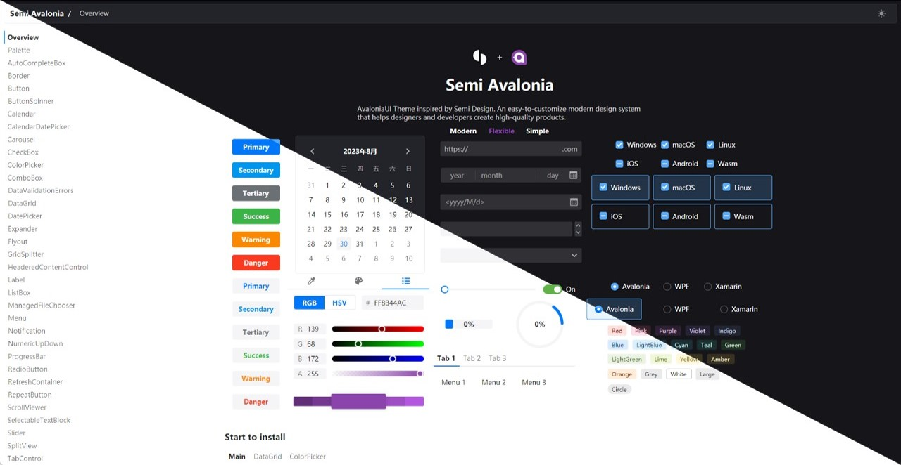

# Semi Avalonia

[](https://www.nuget.org/packages/Semi.Avalonia/)
[](https://www.nuget.org/packages/Semi.Avalonia/)

[中文](./README_CN.md)

Avalonia Theme inspired by Semi Design

If you are looking for more customized controls, Please try [Ursa](https://github.com/irihitech/Ursa.Avalonia)



## How to Use

### Installation

```bash
dotnet add package Semi.Avalonia
```

Include Semi Design Styles in application:

```xaml
<Application.Styles>
    <StyleInclude Source="avares://Semi.Avalonia/Themes/Index.axaml" />
</Application.Styles>
```

That's all.

ColorPicker, DataGrid and TreeDataGrid are distributed in separated packages. Please install if you need.

```bash
dotnet add package Semi.Avalonia.ColorPicker
dotnet add package Semi.Avalonia.DataGrid
dotnet add package Semi.Avalonia.TreeDataGrid
```

```xaml
<Application.Styles>
    <StyleInclude Source="avares://Semi.Avalonia.ColorPicker/Index.axaml" />
    <StyleInclude Source="avares://Semi.Avalonia.DataGrid/Index.axaml" />
    <StyleInclude Source="avares://Semi.Avalonia.TreeDataGrid/Index.axaml" />
</Application.Styles>
```

If AOT publishing is required, you need to include the rd.xml file in your project:

```xml
<ItemGroup>
    <RdXmlFile Include="rd.xml"/>
</ItemGroup>
```

The contents of the rd.xml file should be as follows:

```xml
<?xml version="1.0" encoding="utf-8"?>
<Directives>
    <!--
        This file is part of RdXmlLibrary project.
        Visit https://github.com/kant2002/rdxmllibrary for latest version.
        If you have modifications specific to this Nuget package,
        please contribute back.
    -->
    <Application>
        <Assembly Name="Avalonia.Markup.Xaml" Dynamic="Required All"/>
        <Assembly Name="Semi.Avalonia" Dynamic="Required All"/>
        <!-- If you don't use these, please don't include them.
            <Assembly Name="Semi.Avalonia.DataGrid" Dynamic="Required All"/>
            <Assembly Name="Semi.Avalonia.ColorPicker" Dynamic="Required All"/>
        -->
    </Application>
</Directives>
```

## Demo

You can always download demo executable to play around with Semi Avalonia Themes.
<https://github.com/irihitech/Semi.Avalonia/releases>

## Support

We offer limited free community support for Semi Avalonia and Ursa. If you have any question or suggestion, feel free to raise issues and discussions via GitHub, and you are welcomed to join our group via FeiShu(Lark)

 

## Version compatibility

| Semi Design Version | Avalonia Version |
|:--------------------|:-----------------|
| 11.1.0-rc           | >=11.1.0-rc      |
| 11.0.7              | >=11.0.7         |
| 11.0.1              | <=11.0.6         |

## Credits

[Semi Design](https://semi.design/)

[Avalonia](https://github.com/AvaloniaUI/Avalonia)

[FluentAvalonia](https://github.com/amwx/FluentAvalonia)

[Material Design Icons](https://pictogrammers.com/library/mdi/)

[CommunityToolKit](https://github.com/CommunityToolkit/dotnet)

